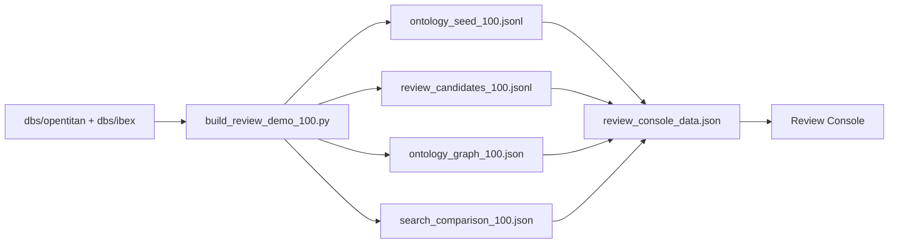
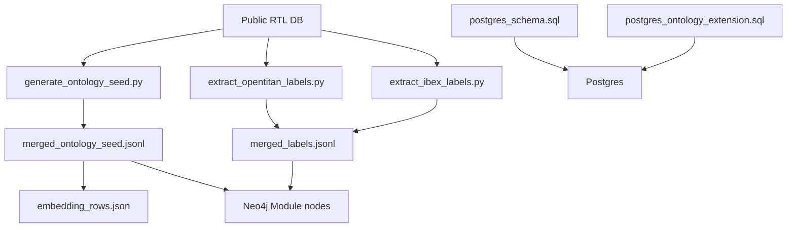
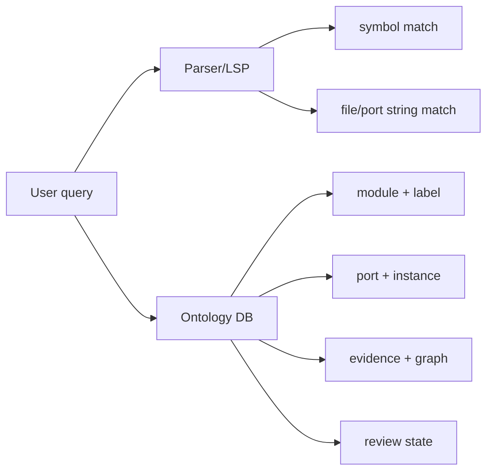

# Workflow Map

## Quick Demo Workflow



실행:

```powershell
powershell -NoProfile -ExecutionPolicy Bypass -File .\workflow.ps1 -Step demo
```

## Full Knowledge DB Workflow



실행:

```powershell
powershell -NoProfile -ExecutionPolicy Bypass -File .\workflow.ps1 -Step full
```

## Search Behavior



Parser/LSP는 빠른 코드 탐색에 좋습니다. Ontology DB는 역할, protocol, evidence, graph 관계를 함께 보므로 review와 generation guardrail에 더 적합합니다.
